# Algorithm assignment 5
#### Model 1: 3 Layers with 1 Convolution layer
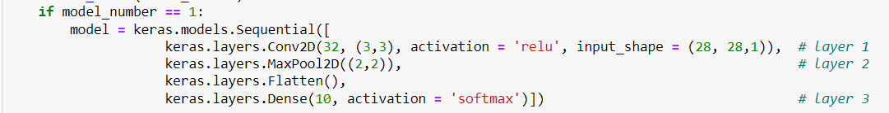
#### Training
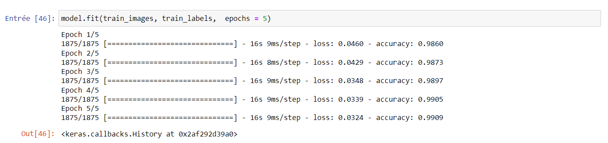
#### Accuracy
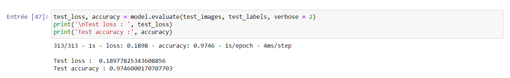
#### Success cases
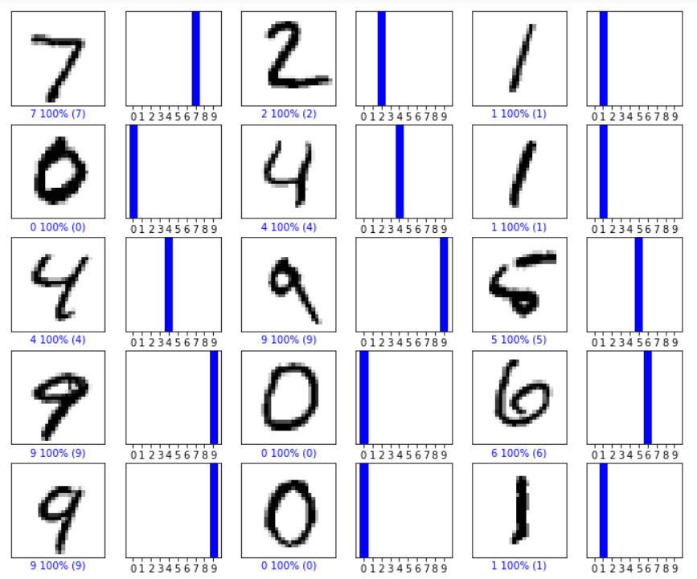
#### Failure cases

-------------

#### Model 2: 5 Layers with 2 Convolution layer
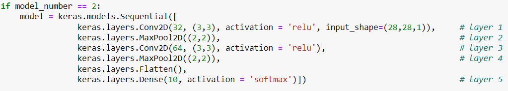
#### Training
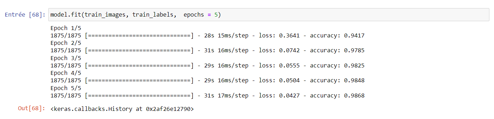
#### Accuracy
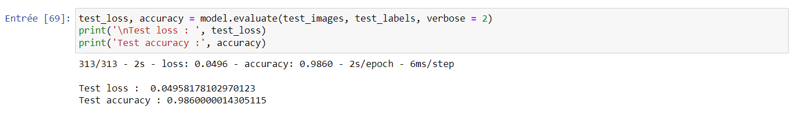
#### Success cases
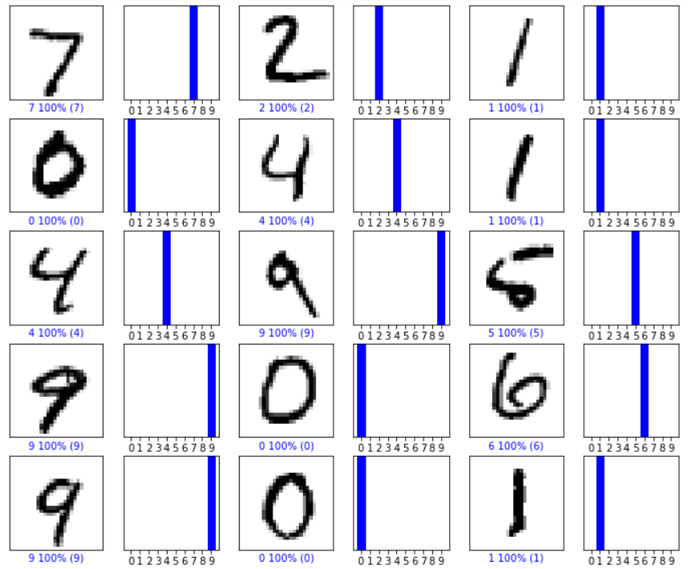
#### Failure cases
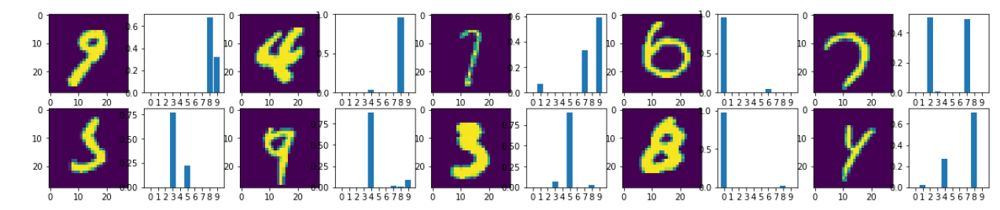

-------------

#### Model 3: 7 Layers with 4 Convolution layer
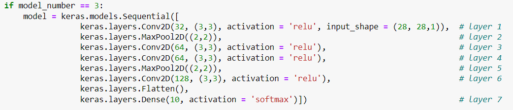
#### Training
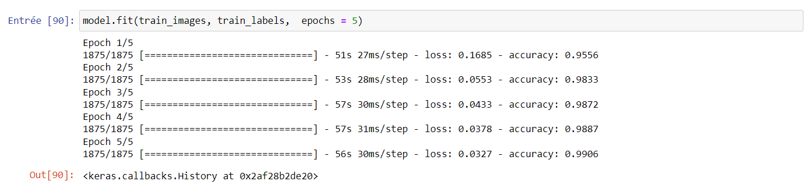
#### Accuracy
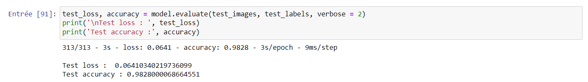
#### Success cases
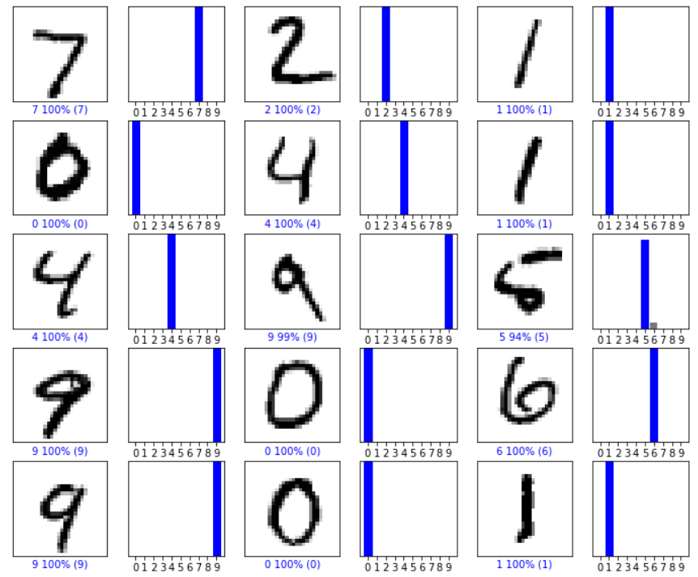
#### Failure cases

